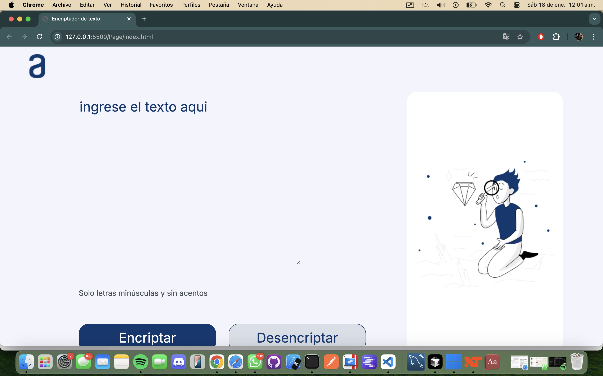

# Encriptador de Texto

## Descripción

Este proyecto es una aplicación web que permite encriptar y desencriptar mensajes de texto de manera sencilla. La herramienta es ideal para enviar mensajes con un nivel básico de cifrado, asegurando que el texto no sea fácilmente legible sin desencriptarlo. 

El diseño es minimalista y funcional, con compatibilidad para navegadores modernos.

## Características

- **Encriptar texto:** Convierte texto plano en una versión encriptada.
- **Desencriptar texto:** Recupera el mensaje original a partir del texto encriptado.
- **Copiar mensaje:** Permite copiar el resultado al portapapeles con un solo clic.
- **Validación de entrada:** Solo permite letras minúsculas sin acentos.

## Requisitos Previos

Para ejecutar este proyecto, necesitas un navegador moderno que soporte HTML5, CSS3 y JavaScript.

## Cómo Usar

1. Clona este repositorio o descarga los archivos.
2. Abre el archivo `index.html` en tu navegador.
3. Ingresa el texto en el área de texto indicada.
4. Haz clic en:
   - **"Encriptar"** para convertir el texto en un mensaje encriptado.
   - **"Desencriptar"** para recuperar el mensaje original.
5. Usa el botón **"Copiar"** para copiar el mensaje resultante al portapapeles.

## Tecnologías Utilizadas

- **HTML5:** Estructura del proyecto.
- **CSS3:** Estilos y diseño.
- **JavaScript:** Lógica de encriptación y desencriptación.
- **Google Fonts:** Fuente `Inter` para mejorar la apariencia.

## Captura de Pantalla

## Licencia

Este proyecto está licenciado bajo la **MIT License**.

